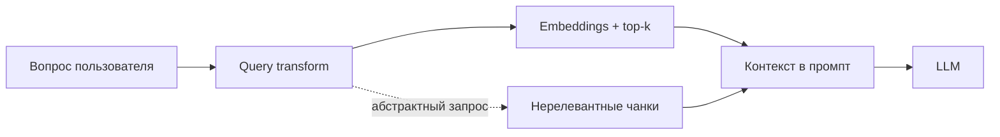

# Отладка retrieval: логи и промпт query transform

Документ фиксирует расследование случая, когда бот отвечал «Я не нашел ответа…» на вопрос, который **дословно** есть в `data/sberbank_help_documents.json`, а также внесённые изменения и выводы.

**Дата:** 02.06.2026  
**Сырой лог:** [`logs/bot.log`](../logs/bot.log) (фрагмент ~строки 297–374)

## Симптом

Пользователь задал вопрос из FAQ:

> Какие карты можно получить доставкой?

В JSON есть соответствующая запись (`full_text` с тем же текстом в блоке «Вопрос:»). Бот вернул шаблон из `prompts/conversation_system.txt`: *«Я не нашел ответа на ваш вопрос в доступных документах.»*

## Как искали причину

### 1. Логирование RAG в консоль и `logs/bot.log`

В `src/rag.py` добавлен отладочный вывод с префиксом `[RAG]` (включается через `RAG_DEBUG`, по умолчанию `true`):

| Что логируется | Зачем |
|----------------|--------|
| Исходный вопрос пользователя | С чем сравнивать retrieval |
| Запрос после query transform | Видеть, не «размыл» ли LLM формулировку |
| Similarity ranking (top `RAG_DEBUG_TOP_K`, по умолчанию 10) | Все кандидаты со **score** и полем `Q="..."` для JSON |
| Ranking по **оригинальному** вопросу (если transform изменил текст) | Отделить ошибку transform от ошибки embeddings |
| Top-`RETRIEVER_K` чанков, ушедших в промпт | Что реально увидела модель |
| Проверка: есть ли текст вопроса в найденных чанках | Быстрый сигнал промаха retrieval |
| Превью контекста и ответа | Отличить «не нашли чанк» от «чанк есть, LLM отказала» |

Переменные окружения (`src/config.py`):

```env
RAG_DEBUG=true
RAG_DEBUG_TOP_K=10
RETRIEVER_K=3
```

После изменения промптов нужен **перезапуск бота** — промпты кешируются при первом запросе.

### 2. Пример из лога (до исправления промпта)

**Transform переписал вопрос:**

| | Текст |
|---|--------|
| Пользователь | Какие карты можно получить доставкой? |
| Поисковый запрос | перечень банковских дебетовых и кредитных карт с возможностью бесплатной доставки… по всей россии |

Старый промпт `query_transform.txt` требовал *«подробный, не краткий»* и *«лучше более абстрактный, чем конкретный»* — из-за этого точный FAQ-вопрос превращался в обобщённый запрос про «доставку по России».

**Ranking по преобразованному запросу (top 10):**

| Место | Q&A в чанке |
|-------|-------------|
| 1–3 | «В каких городах можно заказать доставку карты?» |
| **7–9** | **«Какие карты можно получить доставкой?»** ← нужный ответ |

**Ranking по оригинальному вопросу (только для сравнения в логе):**

| Место | Q&A |
|-------|-----|
| **1–3** | **«Какие карты можно получить доставкой?»** |

**В промпт попали только top-3** (`RETRIEVER_K=3`) по **transformed** запросу — три длинных чанка про **города**, без нужного Q&A. Контекст ~9 600 символов, предупреждение: `No chunk contains the user question text`.

## Выводы

1. **Данные и индекс в порядке** — нужный Q&A в базе есть; по исходной формулировке он на **1-м месте** в similarity ranking.
2. **Корневая причина — query transform**, а не отсутствие документа и не «плохие» embeddings: абстрактный переписанный запрос сместил релевантность к соседнему FAQ («в каких городах…»).
3. **`RETRIEVER_K=3` усугубил сбой** — правильный чанк был на 7-м месте и не попал в контекст.
4. **Дубликаты в индексе** — один и тот же Q&A встречается несколько раз (`seq=7`, `8`, `22`, …), из-за чего три слота top-k могут занять копии одного нерелевантного ответа.
5. **Ответ LLM «не нашёл»** в этом случае следствие **неверного retrieval**: в контексте не было ответа на вопрос, модель корректно сработала по `conversation_system.txt`.



## Что изменили

### Промпт `prompts/query_transform.txt`

Переписан под поиск по FAQ:

- сохранять формулировку и ключевые слова последнего вопроса;
- не обобщать короткие ясные вопросы в «перечень / обзор / по всей России»;
- подтягивать контекст из истории **только** для неясных уточнений;
- один запрос, 1–2 предложения.

**Результат:** после перезапуска бота ответ на тот же вопрос стал релевантным (transform остаётся близким к исходному тексту, нужный Q&A попадает в top-k).

### Код (для воспроизводимости отладки)

- `src/rag.py` — пошаговый RAG с логами `[RAG]`
- `src/config.py` — `RAG_DEBUG`, `RAG_DEBUG_TOP_K`
- `src/indexer_with_json.py` — при загрузке JSON логируется sample metadata и превью первого документа

## Как читать лог при похожих проблемах

| Наблюдение в логе | Вероятная причина |
|-------------------|------------------|
| `Query was CHANGED by transform` и нужный Q&A низко в ranking **transformed**, но высоко в **original** | Править `query_transform.txt` или отключить transform для простых вопросов |
| Нужный Q&A есть в top 10, но не в top `RETRIEVER_K` | Увеличить `RETRIEVER_K` или улучшить запрос |
| `No chunk contains the user question text` | Retrieval промахнулся (формулировка, опечатка, transform) |
| Нужный чанк в контексте, но `LLM returned 'not found'` | Промпт ответа / модель, не индекс |
| Одинаковые `Q="..."` на нескольких позициях | Дубликаты в JSON при индексации — теряются слоты top-k |

## Что можно сделать дальше (не реализовано)

- **Дедупликация** Q&A при индексации JSON (не индексировать одинаковый `full_text` несколько раз).
- **Увеличить `RETRIEVER_K`** как страховку, если transform снова уедет в сторону.
- **Гибридный retrieval**: поиск и по transform, и по последнему сообщению пользователя с объединением результатов.
- **Отключить transform** для однофразных вопросов без истории.

## Связанные файлы

| Файл | Роль |
|------|------|
| `prompts/query_transform.txt` | Промпт переписывания поискового запроса |
| `prompts/conversation_system.txt` | Ответ по контексту; шаблон «не нашёл» |
| `src/rag.py` | Retrieval, логирование, цепочка ответа |
| `data/sberbank_help_documents.json` | Источник Q&A (`full_text`) |
| `src/indexer_with_json.py` | Индексация JSON без чанкинга |
